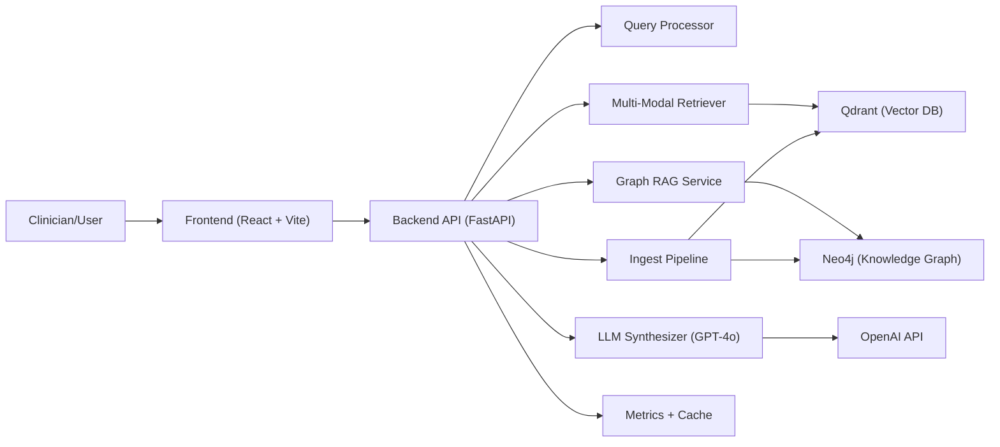

# MedGraph AI — System Architecture

## High-level overview
MedGraph AI is a multi-modal clinical knowledge navigator that combines:
1. Vector retrieval over heterogeneous data (clinical notes, image descriptions, audio transcripts, and lab tables).
2. Medical ontology traversal in Neo4j for structured relationship reasoning.
3. LLM synthesis that grounds responses in retrieved evidence and graph context.

The system is built as a containerized, service-oriented stack with a FastAPI backend and React frontend.

## Core architecture

## Backend services

### FastAPI application layer
- Entry point: `backend/app/main.py`
- Responsibilities:
  - App lifecycle startup/shutdown
  - Health checks
  - CORS and rate limiting
  - Route registration (`query`, `ingest`, `graph`, `metrics`)
  - Global exception handling

### Query intelligence layer
- `query_processor.py`:
  - Abbreviation expansion (clinical shorthand normalization)
  - Intent classification
  - Retrieval planning hints
- `retrieval.py`:
  - Multi-modal retrieval orchestration
  - Modality-specific vector queries
  - Reciprocal Rank Fusion (RRF) for cross-modality result fusion
  - Per-modality fault isolation
- `graph_rag.py`:
  - Entity extraction
  - Multi-hop graph traversal
  - Graph context rendering for LLM prompt enrichment
- `llm.py`:
  - Streaming and non-streaming synthesis
  - Clinical response structure and safety-oriented prompting

### Ingestion layer
- `multimodal.py`:
  - Text chunking and embedding
  - Image embedding + clinical description generation
  - Audio transcription + transcript embedding
  - Lab table normalization and abnormality extraction
  - Unified upsert into vector storage

### Data access layer
- `qdrant_client.py`: Async Qdrant collections, upsert/search, connectivity
- `neo4j_client.py`: Async Cypher execution, schema/index setup, stats

### Operational support
- `core/cache.py`: TTL query cache for repeated query acceleration
- `utils/metrics.py`: in-process telemetry collector
- `utils/error_handlers.py`: structured API error envelopes and exception mapping

## Data model

### Vector collections (Qdrant)
- `medical_text` (384)
- `medical_images` (512)
- `medical_audio` (384)
- `medical_tables` (384)

Each point stores vector + payload metadata (`doc_id`, modality, source, clinical metadata).

### Graph ontology (Neo4j)
Primary labels:
- `Drug`
- `Disease`
- `Symptom`
- `Gene`
- `LabTest`

Representative relationship types:
- `TREATS`
- `INTERACTS_WITH`
- `CONTRAINDICATED_FOR`
- `MANIFESTS_AS`
- `DIAGNOSED_BY`
- `CAUSES`
- `AFFECTS`

Schema includes uniqueness constraints, fulltext indexes, and property indexes for performant traversal/search.

## Query execution flow
1. Frontend posts query request (`/api/v1/query`).
2. Query processor normalizes abbreviations and classifies intent.
3. Retriever runs modality-specific similarity search in Qdrant.
4. Graph service performs entity-based Neo4j traversal (if enabled).
5. Retriever results + graph subgraph are converted to LLM context.
6. LLM streams response chunks via SSE to the UI.
7. Metrics and cache are updated.

## Reliability and degradation strategy
- If one retrieval modality fails, remaining modalities proceed.
- If graph traversal fails, query continues with empty graph context and metadata warning.
- If LLM streaming fails mid-response, client receives explicit stream error event and clean stream termination.
- Global handlers convert known and unknown exceptions into consistent JSON envelopes.

## Frontend architecture
- React + TypeScript + Zustand + React Query + Tailwind
- Feature pages:
  - Query workspace
  - Graph explorer
  - Data ingest
  - Metrics dashboard
- SSE hook for incremental response rendering and state synchronization.

## Deployment topology
- `frontend` (Nginx static host + API reverse proxy)
- `backend` (FastAPI/Uvicorn workers)
- `qdrant` (vector DB)
- `neo4j` (graph DB)
- Shared Docker network via `docker-compose`

## CI/CD and quality gates
- GitHub Actions pipeline:
  - Backend formatting checks (`black`, `isort`)
  - Backend tests with Neo4j/Qdrant service containers
  - Frontend build and test
  - Full Docker Compose smoke test

## Security and compliance notes
- No PHI persistence policy is not enforced by code; deployment context must enforce data governance.
- API keys are environment-managed (`.env`, CI secrets).
- Nginx security headers set for SPA serving path.
- For production hardening, add:
  - TLS termination
  - authn/authz
  - audit logging
  - data retention and encryption policies.

